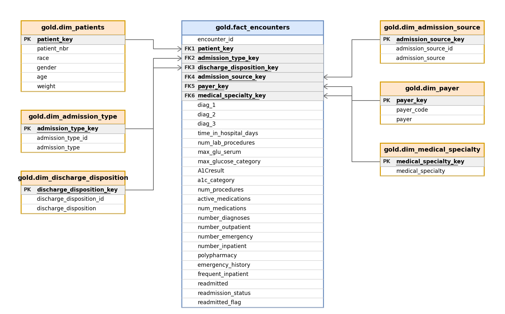

# SQL Data Warehouse Project — Diabetes Patient Readmissions

A SQL-based data warehouse built on the **Diabetes 130-US Hospitals** dataset, modeling patient encounters and 30 day readmission outcomes.

---

## 📌 Project Overview

This project transforms raw, messy hospital encounter data into a clean, query ready analytical model using the **Medallion Architecture** (Bronze → Silver → Gold). It demonstrates:

- Raw data ingestion (Bronze Layer)
- Data cleaning, standardization, and quality testing (Silver Layer)
- Dimensional modeling with a star schema (Gold Layer)
- Documentation practices used in real world data warehousing (data catalog, ER diagram)

**Source data:** UCI Diabetes 130-US Hospitals for Years 1999–2008 dataset — ~100,000 hospital encounters for diabetic patients, including demographics, admission/discharge details, diagnoses, medications, lab results, and readmission status.

---

## 🏗️ Architecture

```
Raw CSV   →   Bronze Layer   →   Silver Layer   →   Gold Layer   →   Reporting / BI
             (raw load,          (cleaned,           (star schema,     (SQL queries,
              as-is)              standardized,        business-ready)   dashboards)
                                  tested)
```

- **Bronze Layer:** Raw data loaded as is from the source CSV, with minimal to no transformation. This preserves an untouched copy of the source data for traceability.
- **Silver Layer:** One table per subject area (patients, admissions, diagnoses, medications, labs, utilization, outcomes), each keyed by `encounter_id` (or `patient_nbr` for patients). Data is cleaned, standardized, and validated with quality checks.
- **Gold Layer:** A star schema built as SQL views on top of Silver, one fact table (`fact_encounters`) surrounded by descriptive dimension tables, plus a small set of ready to use summary views.

---

## ⭐ Data Model

The Gold Layer follows a star schema: `fact_encounters` sits at the center, with dimension tables joined in via surrogate keys.



**Grain:** One row in `fact_encounters` = one hospital encounter.

| Table | Type | Description |
|---|---|---|
| `gold.fact_encounters` | Fact | Encounter-level measures, flags, and the readmission outcome |
| `gold.dim_patients` | Dimension | Patient demographics |
| `gold.dim_admission_type` | Dimension | Type of admission (e.g. Emergency, Elective) |
| `gold.dim_discharge_disposition` | Dimension | Where/how the patient was discharged |
| `gold.dim_admission_source` | Dimension | Where the patient was admitted from |
| `gold.dim_payer` | Dimension | Insurance/payer information |
| `gold.dim_medical_specialty` | Dimension | Specialty of the admitting physician |

Full column-level definitions are documented in [`docs/data_catalog_gold_layer.md`](docs/data_catalog_gold_layer.md).

---

## ✅ Data Quality Testing

The `tests/` folder contains SQL scripts that validate the Silver and Gold layers after each load — checking things like primary key uniqueness, unexpected NULLs, and referential consistency.

---

## 📁 Repository Structure

```
SQL-data-warehouse-project/
│
├── dataset/
│   └── *.csv                        -- Raw source data
│
├── docs/
│   ├── gold_layer_data_model.png    -- ER diagram (image)
│   ├── gold_layer_data_model.drawio -- Editable diagram source
│   └── data_catalog_gold_layer.md   -- Full data catalog
│
├── scripts/
│   ├── bronze/
│   │   ├── ddl.sql                  -- Bronze table definitions
│   │   └── process_load.sql         -- Bronze load script
│   ├── silver/
│   │   ├── ddl.sql                  -- Silver table definitions
│   │   └── process_load.sql         -- Silver transformation/load script
│   └── gold/
│       └── ddl.sql                  -- Gold layer views (dimensions + fact)
│
├── tests/
│   └── *.sql                        -- Data quality checks
│
└── README.md
```

---

## 📊 Example Analysis

Once the Gold Layer is built, questions like this become a single query:

```sql
-- Overall 30-day readmission rate
SELECT 
    ROUND(AVG(readmitted_flag * 1.0) * 100, 2) AS pct_readmitted
FROM gold.fact_encounters;

-- Readmission rate by admission type
SELECT
    at_.admission_type,
    COUNT(*) AS total_encounters,
    ROUND(AVG(f.readmitted_flag * 1.0) * 100, 2) AS pct_readmitted
FROM gold.fact_encounters f
LEFT JOIN gold.dim_admission_type at_ 
    ON f.admission_type_key = at_.admission_type_key
GROUP BY at_.admission_type;
```

---

## 🛠️ Tech Stack

- **SQL Server** (T-SQL)
- **draw.io / diagrams.net** for ER diagram design

---

## 👤 About

This project is part of my portfolio as I transition from a background in Pharmaceutical Sciences into Computer Science / Data Science. It reflects hands on practice with data warehousing fundamentals: dimensional modeling, star schema design, and SQL view based ETL.

---

## 📄 Data Source

Dataset: [Diabetes 130-US Hospitals for Years 1999–2008](https://archive.ics.uci.edu/dataset/296/diabetes+130-us+hospitals+for+years+1999-2008).
